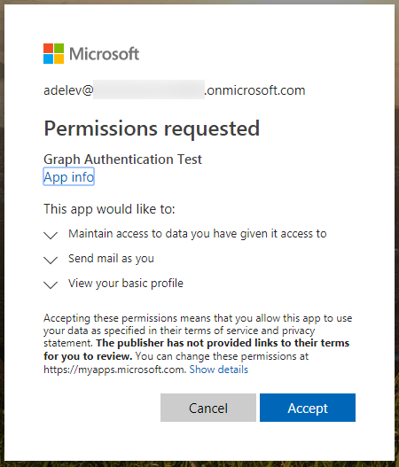
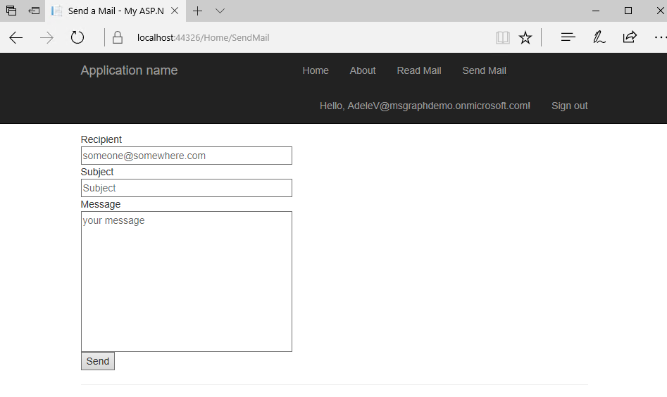

# Dynamic permissions with the Azure AD v2.0 endpoint and Microsoft Graph

This demo will walk you through creating a web application that connects with Microsoft Graph using OpenID Connect and requests additional permissions.

## Register the application for Dynamic permissions

**Note:** You can reuse the same application registration from the previous lab, [Connecting with Microsoft Graph using OpenID Connect](../02-openid-connect/readme.md). If you have already completed the app registration, move to the next section.

If you are not reusing your previously created application registration, follow the steps in [Register the application for getting tokens using REST](../01-rest-via-powershell/readme.md#register-the-application-for-getting-tokens-using-rest).

> **Note**: If you have completed the previous lab, you can use the same Visual Studio project for this lab. If you have not completed the previous lab, download and configure the starter project using the following steps:
>
> 1. From your shell or command line:
>
>     ```shell
>     git clone https://github.com/Azure-Samples/active-directory-dotnet-webapp-openidconnect-v2.git
>     ```
>
> 1. Open the solution using **Visual Studio 2017**. Restore the missing **NuGet** packages and reload the solution.
>
> 1. Edit the **web.config** file with your app's coordinates. Find the appSettings key `ida:ClientId` and provide the app ID from your app registration. Find the appSettings key `ida:ClientSecret` and provide the value from the app secret generated in the previous step.

## Inspect the code sample for Dynamic permissions

1. Open the **App_Start/Startup.Auth.cs** file. This is where authentication begins using the OWIN middleware.

1. Verify that the `Scope` variable in your code is equal to `AuthenticationConfig.BasicSignInScopes + " email Mail.Read"`. Change it if needed.

    ```csharp
    app.UseOpenIdConnectAuthentication(
        new OpenIdConnectAuthenticationOptions
        {
            // The `Authority` represents the v2.0 endpoint - https://login.microsoftonline.com/common/v2.0
            Authority = AuthenticationConfig.Authority,
            ClientId = AuthenticationConfig.ClientId,
            RedirectUri = AuthenticationConfig.RedirectUri,
            PostLogoutRedirectUri = AuthenticationConfig.RedirectUri,
            Scope = AuthenticationConfig.BasicSignInScopes + " email Mail.Read", // a basic set of permissions for user sign in & profile access "openid profile offline_access"
            TokenValidationParameters = new TokenValidationParameters
            {
                ValidateIssuer = false,
                // In a real application you would use IssuerValidator for additional checks, like making sure the user's organization has signed up for your app.
                //     IssuerValidator = (issuer, token, tvp) =>
                //     {
                //        //if(MyCustomTenantValidation(issuer))
                //        return issuer;
                //        //else
                //        //    throw new SecurityTokenInvalidIssuerException("Invalid issuer");
                //    },
                //NameClaimType = "name",
            },
    ```

1. When an authorization code is received, the code is redeemed for an access token and a refresh token, which are stored in cache. Notice the scope that is requested, `Mail.Read`. The token that is received is only valid for reading emails. If the application attempts to send an email, it would fail because the app has not been granted consent.

    ```csharp
                Notifications = new OpenIdConnectAuthenticationNotifications()
                {
                    AuthorizationCodeReceived = OnAuthorizationCodeReceived,
                    AuthenticationFailed = OnAuthenticationFailed,
                }
            });
    }

    private async Task OnAuthorizationCodeReceived(AuthorizationCodeReceivedNotification context)
    {
        // Upon successful sign in, get the access token & cache it using MSAL
        IConfidentialClientApplication clientApp = MsalAppBuilder.BuildConfidentialClientApplication(new ClaimsPrincipal(context.AuthenticationTicket.Identity));
        AuthenticationResult result = await clientApp.AcquireTokenByAuthorizationCode(new[] { "Mail.Read" }, context.Code).ExecuteAsync();
    }
    ```

1. Open the **Controllers/HomeController.cs** file. Scroll down to the `SendMail` method with no parameters. When an HTTP GET is issued to this page, it will use the `BuildConfidentialClientApplication` helper method to get an object that implements `IConfidentialClientApplication`. It then calls `AcquireTokenSilent` using the `Mail.Send` scope. This scope was not requested when the app started so the user will not have already consented.  The MSAL code will look in the cache for a token matching the scope, then attempt using the refresh token, and finally will fail if the user has not consented.

    ```csharp
    [Authorize]
    [HttpGet]
    public async Task<ActionResult> SendMail()
    {
        // Before we render the send email screen, we use the incremental consent to obtain and cache the access token with the correct scopes
        IConfidentialClientApplication app = MsalAppBuilder.BuildConfidentialClientApplication();
        AuthenticationResult result = null;
        var accounts = await app.GetAccountsAsync();
        string[] scopes = { "Mail.Send" };

        try
        {
            // try to get an already cached token
            result = await app.AcquireTokenSilent(scopes, accounts.FirstOrDefault()).ExecuteAsync().ConfigureAwait(false);
        }
        catch (MsalUiRequiredException ex)
        {
            // A MsalUiRequiredException happened on AcquireTokenSilentAsync.
            // This indicates you need to call AcquireTokenAsync to acquire a token
            Debug.WriteLine($"MsalUiRequiredException: {ex.Message}");

            try
            {
                // Build the auth code request Uri
                string authReqUrl = await OAuth2RequestManager.GenerateAuthorizationRequestUrl(scopes, app, this.HttpContext, Url);
                ViewBag.AuthorizationRequest = authReqUrl;
                ViewBag.Relogin = "true";
            }
            catch (MsalException msalex)
            {
                Response.Write($"Error Acquiring Token:{System.Environment.NewLine}{msalex}");
            }
        }
        catch (Exception ex)
        {
            Response.Write($"Error Acquiring Token Silently:{System.Environment.NewLine}{ex}");
        }

        return View();
    }
    ```

1. Open the **Utils/OAuth2CodeRedeemerMiddleware.cs** file and scroll down to the `GenerateAuthorizationRequestUrl` method. This method will generate the request to the authorize endpoint to request additional permissions.

    ```csharp
    public static async Task<string> GenerateAuthorizationRequestUrl(string[] scopes, IConfidentialClientApplication cca, HttpContextBase httpcontext, UrlHelper url)
    {
        string signedInUserID = ClaimsPrincipal.Current.FindFirst(System.IdentityModel.Claims.ClaimTypes.NameIdentifier).Value;
        string preferredUsername = ClaimsPrincipal.Current.FindFirst("preferred_username").Value;
        Uri oauthCodeProcessingPath = new Uri(httpcontext.Request.Url.GetLeftPart(UriPartial.Authority).ToString());
        string state = GenerateState(httpcontext.Request.Url.ToString(), httpcontext, url, scopes);
        string tenantID = ClaimsPrincipal.Current.FindFirst("http://schemas.microsoft.com/identity/claims/tenantid").Value;

        string domain_hint = (tenantID == ConsumerTenantId) ? "consumers" : "organizations";

        Uri authzMessageUri = await cca
            .GetAuthorizationRequestUrl(scopes)
            .WithRedirectUri(oauthCodeProcessingPath.ToString())
            .WithLoginHint(preferredUsername)
            .WithExtraQueryParameters(state == null ? null : "&state=" + state + "&domain_hint=" + domain_hint)
            .WithAuthority(cca.Authority)
            .ExecuteAsync(CancellationToken.None)
            .ConfigureAwait(false);

        return authzMessageUri.ToString();
    }
    ```

## Run the application for Dynamic permissions

1. Run the application. Select the **sign in** link in the top right to sign in.

    

    

1. After signing in, if you have not already granted consent, the user is prompted for consent.

    

1. After consenting, select the **About** link. Information  is displayed from your current set of claims in the OpenID Connect flow.

    

1. Since you are now logged in, the **Send Mail** link is now visible. Click the **Send Mail** link.

    >Note: The app was consented the ability to read mail, but was not consented to send an email on the user's behalf. The MSAL code attempts a call to `AcquireTokenSilent`, which fails because the user did not consent. The application catches the exception and the code builds a URL to the authorize endpoint to request the `Mail.Send` permission. The link looks similar to: `https://login.microsoftonline.com/common/oauth2/v2.0/authorize?scope=Mail.Send+offline_access+openid+profile&response_type=code&client_id=0777388d-640c-4bc3-9053-671d6a8300c4&redirect_uri=https:%2F%2Flocalhost:44326%2F&login_hint=AdeleV%40msgraphdemo.onmicrosoft.com&prompt=select_account&domain_hint=organizations`

    

    

1. After selecting **Accept**, you are redirected back to the application and the app can now send an email on your behalf.

    