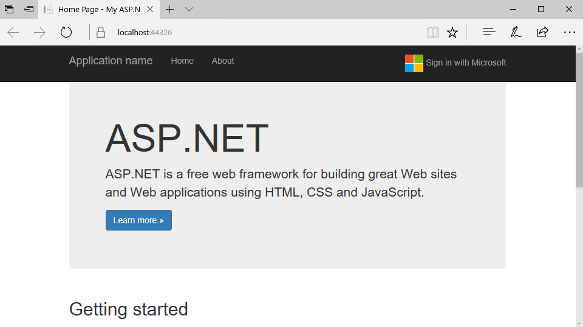
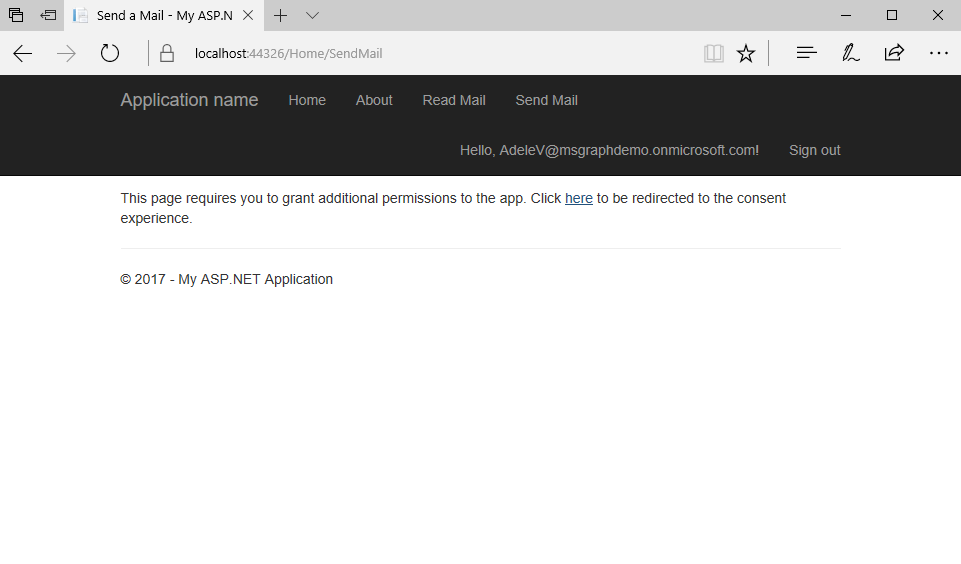

# Dynamic permissions with the Azure AD v2.0 endpoint and Microsoft Graph

This demo will walk you through creating a web application that connects with Microsoft Graph using OpenID Connect and requests additional permissions.

## Register the application for Dynamic permissions

**Note:** You can reuse the same application registration from the previous lab, [Connecting with Microsoft Graph using OpenID Connect](#exercise2). If you have already completed the app registration, move to the next section.

1. If you are not reusing your previously created application registration, visit the [Application Registration Portal](https://apps.dev.microsoft.com/) to register the application.

1. Once the application is created, an app ID is provided on the screen. Copy this ID, you will use it as the Client ID.

1. Add a new app secret by selecting the **Generate new password** button and copy the secret to use later as the Client Secret.

1. Select the **Add Platform** button. A dialog box is presented, choose **Web Application**. 

1. Change the Redirect URL to **https://localhost:44326/**. Select **Save** to save all changes.

    

1. From your shell or command line:

    ```shell
    git clone https://github.com/Azure-Samples/active-directory-dotnet-webapp-openidconnect-v2.git
    ```

1. Open the solution using **Visual Studio 2017**. Restore the missing **NuGet** packages and reload the solution.

1. Edit the **web.config** file with your app's coordinates. Find the appSettings key `ida:ClientId` and provide the app ID from your app registration. Find the appSettings key `ida:ClientSecret` and provide the value from the app secret generated in the previous step.

## Inspect the code sample for Dynamic permissions

1. Open the **App_Start/Startup.Auth.cs** file. This is where authentication begins using the OWIN middleware.

1. Verify that the `Scope` variable in your code is equal to `openid email profile offline_access Mail.Read`. Update it if necessary.

    ```csharp
    app.UseOpenIdConnectAuthentication(
        new OpenIdConnectAuthenticationOptions
        {
            // The `Authority` represents the v2.0 endpoint - https://login.microsoftonline.com/common/v2.0
            // The `Scope` describes the initial permissions that your app will need.  See https://azure.microsoft.com/documentation/articles/active-directory-v2-scopes/

            ClientId = clientId,
            Authority = String.Format(CultureInfo.InvariantCulture, aadInstance, "common", "/v2.0"),
            RedirectUri = redirectUri,
            Scope = "openid email profile offline_access Mail.Read",
            PostLogoutRedirectUri = redirectUri,
            TokenValidationParameters = new TokenValidationParameters
            {
                ValidateIssuer = false,
                // In a real application you would use IssuerValidator for additional checks, like making sure the user's organization has signed up for your app.
                //     IssuerValidator = (issuer, token, tvp) =>
                //     {
                //        //if(MyCustomTenantValidation(issuer))
                //        return issuer;
                //        //else
                //        //    throw new SecurityTokenInvalidIssuerException("Invalid issuer");
                //    },
            },
    ```

1. When an authorization code is received, the code is redeemed for an access token and a refresh token, which are stored in cache. Notice the scope that is requested, `Mail.Read`. The token that is received is only valid for reading emails. If the application attempts to send an email, it would fail because the app has not been granted consent.

    ```csharp
    Notifications = new OpenIdConnectAuthenticationNotifications
    {
        // If there is a code in the OpenID Connect response, redeem it for an access token and refresh token, and store those away.
        AuthorizationCodeReceived = async (context) =>
        {
            var code = context.Code;
            string signedInUserID = context.AuthenticationTicket.Identity.FindFirst(ClaimTypes.NameIdentifier).Value;
            TokenCache userTokenCache = new MSALSessionCache(signedInUserID,
                context.OwinContext.Environment["System.Web.HttpContextBase"] as HttpContextBase).GetMsalCacheInstance();
            ConfidentialClientApplication cca =
                new ConfidentialClientApplication(clientId, redirectUri, new ClientCredential(appKey), userTokenCache,null);
            string[] scopes = { "Mail.Read" };
            try
            {
                AuthenticationResult result = await cca.AcquireTokenByAuthorizationCodeAsync(code, scopes);
            }
            catch (Exception eee)
            {

            }
        },
        AuthenticationFailed = (notification) =>
        {
            notification.HandleResponse();
            notification.Response.Redirect("/Error?message=" + notification.Exception.Message);
            return Task.FromResult(0);
        }
    }
    ```

1. Open the **Controllers/HomeController.cs** file. Scroll down to the `SendMail` method with no parameters. When an HTTP GET is issued to this page, it will create a token cache and create a new `ConfidentialClientApplication` using the app secret. It then calls `AcquireTokenSilentAsync` using the `Mail.Send` scope. This scope was not requested when the app started, the user will not have already consented.  The MSAL code will look in the cache for a token matching the scope, then attempt using the refresh token, and finally will fail if the user has not consented.

    ```csharp
    [Authorize]
    public async Task<ActionResult> SendMail()
    {
        // try to get token silently
        string signedInUserID = ClaimsPrincipal.Current.FindFirst(ClaimTypes.NameIdentifier).Value;
        TokenCache userTokenCache = new MSALSessionCache(signedInUserID, this.HttpContext).GetMsalCacheInstance();
        ConfidentialClientApplication cca = new ConfidentialClientApplication(clientId, redirectUri,new ClientCredential(appKey), userTokenCache, null);
        if (cca.Users.Count() > 0)
        {
            string[] scopes = { "Mail.Send" };
            try
            {
                AuthenticationResult result = await cca.AcquireTokenSilentAsync(scopes,cca.Users.First());
            }
            catch (MsalUiRequiredException)
            {
                try
                {// when failing, manufacture the URL and assign it
                    string authReqUrl = await WebApp.Utils.OAuth2RequestManager.GenerateAuthorizationRequestUrl(scopes, cca, this.HttpContext, Url);
                    ViewBag.AuthorizationRequest = authReqUrl;
                }
                catch (Exception ee)
                {

                }
            }
        }
        else
        {

        }
        return View();
    }
    ```

1. Open the **utils/OAuth2CodeRedeemerMiddleware.cs** file and scroll down to the `GenerateAuthorizationRequestUrl` method. This method will generate the request to the authorize endpoint to request additional permissions.

    ```csharp
    public static async Task<string> GenerateAuthorizationRequestUrl(string[] scopes, ConfidentialClientApplication cca, HttpContextBase httpcontext, UrlHelper url)
    {
        string signedInUserID = ClaimsPrincipal.Current.FindFirst(System.IdentityModel.Claims.ClaimTypes.NameIdentifier).Value;
        string preferredUsername = ClaimsPrincipal.Current.FindFirst("preferred_username").Value;
        Uri oauthCodeProcessingPath = new Uri(httpcontext.Request.Url.GetLeftPart(UriPartial.Authority).ToString());
        string state = GenerateState(httpcontext.Request.Url.ToString(), httpcontext, url, scopes);
        string tenantID = ClaimsPrincipal.Current.FindFirst("http://schemas.microsoft.com/identity/claims/tenantid").Value;
        string domain_hint = (tenantID == "9188040d-6c67-4c5b-b112-36a304b66dad") ? "consumers" : "organizations";
        Uri authzMessageUri =
            await cca.GetAuthorizationRequestUrlAsync(
                scopes,
            oauthCodeProcessingPath.ToString(),
            preferredUsername,
            state == null ? null : "&state=" + state + "&domain_hint=" + domain_hint,
            null,
            // TODo change
            cca.Authority
            );
        return authzMessageUri.ToString();

    }
    ```

## Run the application for Dynamic permissions

1. Run the application. Select the **sign in** link in the top right to sign in.

    

    

1. After signing in, if you have not already granted consent, the user is prompted for consent.

    

1. After consenting, select the **About** link. Information  is displayed from your current set of claims in the OpenID Connect flow.

    

1. Since you are now logged in, the **Read Mail** link is now visible. Select the **Read Mail** link. You can now read email messages from your inbox.

    >Note: The app was consented the ability to read mail, but was not consented to send an email on the user's behalf. The MSAL code attempts a call to `AcquireTokenSilentAsync`, which fails because the user did not consent. The application catches the exception and the code builds a URL to the authorize endpoint to request the `Mail.Send` permission. The link looks similar to: `https://login.microsoftonline.com/common/oauth2/v2.0/authorize?scope=Mail.Send+offline_access+openid+profile&response_type=code&client_id=0777388d-640c-4bc3-9053-671d6a8300c4&redirect_uri=https:%2F%2Flocalhost:44326%2F&login_hint=AdeleV%40msgraphdemo.onmicrosoft.com&prompt=select_account&domain_hint=organizations`

    

1. Select the link. You are now prompted to consent. The permissions include "Send mail as you".

    

1. After selecting **Accept**, you are redirected back to the application and the app can now send an email on your behalf.

    